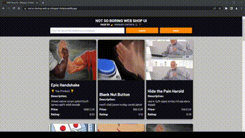

# ShingayiChitaka-IT-Solutions-Frontend

Repository containing the solution for the frontend test for the Tech Academy Program at IT Solutions.

<h2>Project Preview</h2>

<h3>How to run the project: </h3>

There are 2 ways that the project can be viewed.

1) You can view it locally on your machine but be sure to run live-server or a similar local server setup. 

2) The other alternative is that you can simply visit it live here: <a href="https://not-so-boring-web-ui-shingayi-chitaka.netlify.app/">https://not-so-boring-web-ui-shingayi-chitaka.netlify.app/</a> 😅

<h1>About me</h1>
<h2 align="left">Hi 👋, I'm Shingayi Chitaka</h2>
<h3 align="left">A passionate software engineer who builds things for the web.</h3>

Thanks for taking the time to go through my submitted solution. If you have any questions or would simply like to reach out, feel free to do so via my <a href="mailto:shingayidambudzochitaka@gmail.com">email</a>

If you would like to see more of my work then please feel free to visit my <a href="https://shingayichitaka.github.io/">Portfolio</a>

